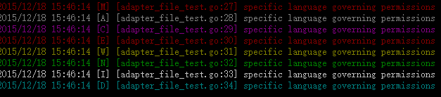

# logmo

是一款开源基于GO语言开发的日志系统，能在windows平台以及linux平台运行并支持色彩日志输出到控制台

## Features
- 支持多日志类型输出
- 支持自定义日志格式输出
- 支持控制台日志色彩输出
- 支持文件日志
- 支持自定义日志过滤处理
- 支持同步与异步写入日志

## Installation

```bash
go get -u github.com/doublemo/logmo
```
## Example

[](examples/example.go)

```go
package main

import (
    "github.com/doublemo/logmo"
    "time"
)

func main() {
    // logmo默认支持控制台输出
    // 增加文件写入

    fw := logmo.NewAdapterFile(10000)
    fw.Filename = "async.log"
    fw.MaxLine = 100
    fw.MaxSize = 1 << 30
    fw.MaxDays = 2
    fw.Rotation = 10
    // 增加日志等级过滤
    fw.AddHook("level", &logmo.HookLevel{logmo.ERROR})
    go fw.Run()

    logmo.AddAdapter("asyncfile", fw)
    logmo.Emerg("specific language governing permissions")
    logmo.Alert("specific language governing permissions")
    logmo.Crit("specific language governing permissions")

    logmo.Err("specific language governing permissions")
    logmo.Warn("specific language governing permissions")
    logmo.Notice("specific language governing permissions")
    logmo.Info("specific language governing permissions")
    logmo.Debug("specific language governing permissions")

    time.Sleep(time.Second * 1)
}

```